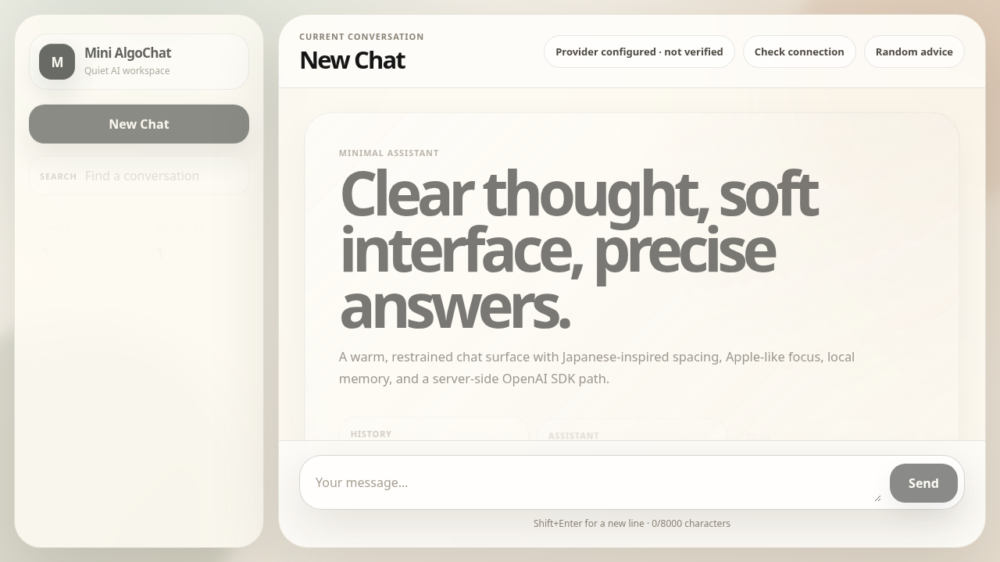
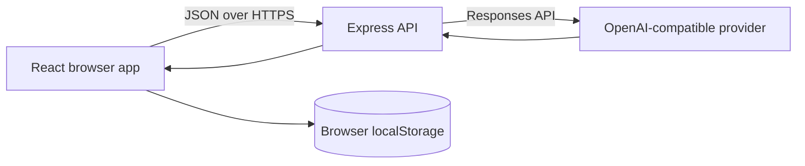

# Mini AlgoChat

A focused full-stack AI chat application built with React, Express, and the official OpenAI SDK. It demonstrates secure server-side provider access, browser-local conversation history, defensive validation, responsive design, and automated testing.

[Live frontend](https://merak-max.github.io/mini-algochat/) · [Source code](https://github.com/merak-max/mini-algochat)



> The public GitHub Pages demo hosts the frontend only. AI replies require a separately configured backend; API keys are never placed in frontend code or GitHub Pages.

## Highlights

- Full conversation workflow with create, search, switch, retry, and delete actions.
- Server-side OpenAI-compatible provider integration without exposing credentials to the browser.
- Markdown replies, code formatting, copy controls, clear connection status, and honest failure states.
- Shared frontend/backend validation with bounded message and context sizes.
- Responsive navigation, keyboard focus states, and reduced-motion support.
- Unit, integration, and Playwright browser tests using an isolated simulated provider.

## How it works

Your browser → Express backend → your AI provider → backend → browser.

- **React** draws the interface and keeps conversations in this browser's local storage.
- **Express** validates messages and calls the AI provider without exposing the API key.
- **Vite** runs the development frontend and forwards `/api` requests to Express.
- **Git/GitHub** track the source code. They are separate from the running application.

Saving history locally does not mean AI inference is local: sending a message sends its conversation context to the configured provider. Do not enter sensitive information unnecessarily.



## Run locally

Use Node.js 22.12+ or 24 LTS and npm. Open a terminal **inside this project directory**:

```sh
npm ci
npm run dev
```

Open `http://127.0.0.1:5173/mini-algochat/` in a browser on the same machine.

This starts two processes: Vite on port **5173** and Express on **8787**. Ctrl+C stops both. If a port is already occupied, stop your previous instance; do not kill an unrelated service. The development proxy expects the backend on 8787.

The interface runs without a key, but will honestly show **AI setup needed**. It will not pretend an echo is a real AI answer. No `.env` file is needed just to explore the interface.

If this workspace runs on a remote server, these addresses belong to that server, not your laptop. Use your editor's private port forwarding for 5173. Do not expose the development server publicly.

## Connect a real AI provider privately

1. Copy `.env.example` to `.env` in this project.
2. Edit `.env` in your local editor; never paste keys into chat or commit them.
3. Set `OPENAI_API_KEY` and the model supported by your provider in `OPENAI_MODEL`.
4. For OpenAI, leave `OPENAI_BASE_URL` blank. For another provider, set its base URL **only if it supports the Responses API** (`POST /v1/responses`). Chat Completions compatibility alone is not sufficient.
5. Leave `VITE_API_BASE_URL` and `FRONTEND_ORIGIN` blank for local use. Keep `PORT=8787` and `HOST=127.0.0.1`.
6. Restart `npm run dev`, click **Check connection**, and send a short message.

**Provider configured** only means the server has a key. **AI reply verified this session** appears after a successful chat response. Provider billing/quota is separate from this app; there is no app-level spending cap yet.

The inherited default model is `gpt-5.2`; this is not a requirement or a recommendation to use a particular provider. Configure your own supported model before verification.

## Features and limits

For an explicitly trusted keyless gateway such as the selected private Bifrost instance, set `OPENAI_BASE_URL`, its provider-prefixed `OPENAI_MODEL`, and `OPENAI_ALLOW_KEYLESS=true` in the ignored `.env`. This suppresses the Authorization header, even if an API key is inherited from the shell. It is off by default and requires a base URL. This changes only this app's outgoing requests, not gateway security. Keep the app bound to loopback; do not expose the unauthenticated backend publicly.

- Create, search, switch and delete conversations; refresh preserves valid browser-local history.
- Markdown/code answers and a copy-reply button. Raw HTML and automatic external image loading are disabled.
- Clear backend status, loading state and errors; retry does not duplicate the failed user message.
- A collapsible conversation list on mobile, keyboard labels/focus styles, and reduced-motion support.
- The separate **Random advice** button is not an AI connection test.
- At most 8,000 characters per message, 80 context messages, and 64,000 total context characters. The app asks you to start a new chat rather than silently discard history.
- Provider requests have a 45-second SDK timeout, no automatic SDK retries, and a 2,048-output-token limit. The browser allows 50 seconds for chat requests.
- Invalid saved history is left untouched, with saving disabled for that session; storage write failures are displayed. Do not clear browser data if you need your saved chats.

## Checks

```sh
npm run check
npx playwright install chromium
npm run test:e2e
npm audit
```

- `check` runs backend/state tests and a production build.
- Browser tests start their own server on 18787 and an isolated local **simulated provider**. They exercise browser → Express → actual SDK → simulated provider. They do **not** use paid keys or prove that a real provider works.
- Browser test screenshots/traces go into ignored `test-results/`. Servers are stopped after tests.
- On a fresh Linux machine Chromium may need system libraries; review that installation before changing a shared machine.

## Main files

| File | Job |
| --- | --- |
| `src/App.jsx` | Conversations, message sending, status and layout |
| `src/MessageContent.jsx` | Markdown rendering and copying |
| `src/chat-state.js` | Loading old saved chats and preparing AI context |
| `src/api.js` | Browser requests, timeouts and readable errors |
| `shared/chat.js` | Message limits and validation shared with the backend |
| `server.js` | Express routes and AI provider calls |
| `src/App.css`, `src/index.css` | Appearance, responsive layout and global basics |
| `test/` | Automated checks and simulated-provider fixtures |
| `CHANGELOG.md` | Work completed, verification and remaining tasks |

## Production preview and hosting

```sh
npm run preview
```

This builds the frontend and serves it with Express at `http://127.0.0.1:8787/mini-algochat/`. A blank `VITE_API_BASE_URL` works because frontend and API share one origin.

GitHub Pages currently deploys the static frontend from `main`. GitHub Pages cannot run Express, so production AI features require a separately hosted backend URL in the build-time `VITE_API_BASE_URL` repository variable. Cross-origin hosting requires the exact frontend origin in `FRONTEND_ORIGIN`. The included Render blueprint binds the hosted backend to `0.0.0.0`; local startup defaults to loopback only.

**Do not expose this backend publicly yet.** Authentication/access control, rate limiting, spending controls and hosting hardening remain future work. CORS is not authentication. Deployment architecture and credentials must be agreed before publishing.
